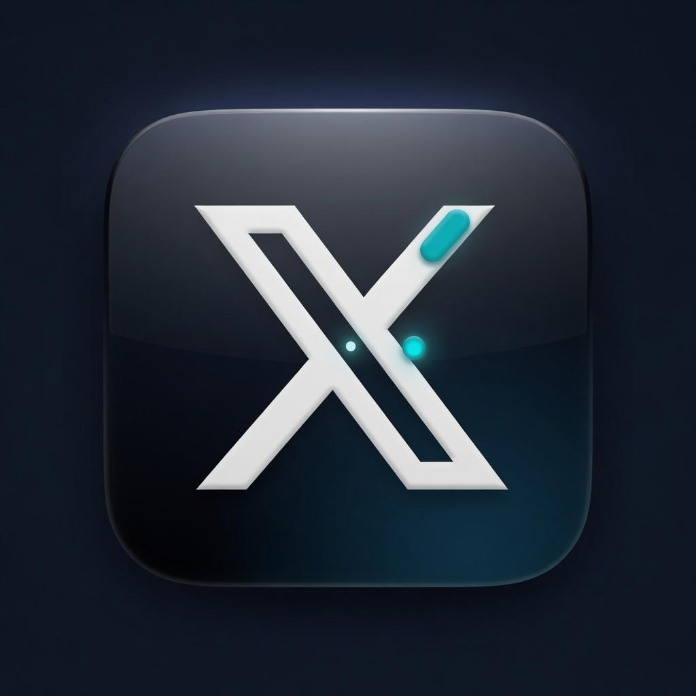
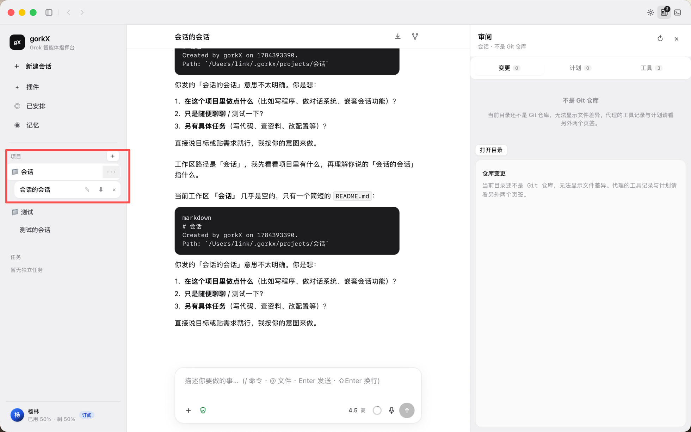
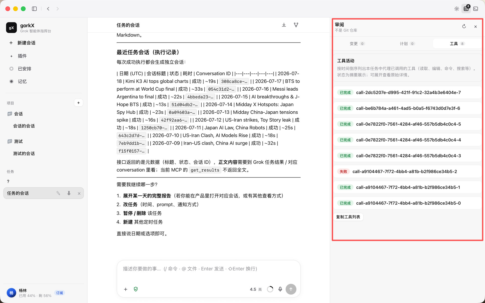
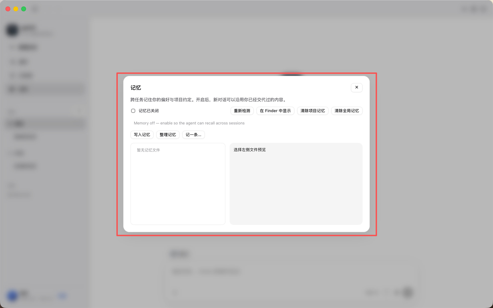

# gorkX

**给每天写代码的人：一台桌面上的 Grok Agent 指挥台。**

gorkX 把开源 **[Grok Build](https://github.com/xai-org/grok-build)** 做成可安装的 **macOS 桌面应用**：项目、任务、权限、审阅、记忆、登录与额度都在同一屏里完成。交互对标 **Codex 指挥台**，引擎是可审计、可升级的 Grok 内核。

**当前版本：0.4.2** · **许可：Apache-2.0** · **首选平台：macOS Apple Silicon**

<p align="center">
  
</p>

<p align="center">
  <a href="https://github.com/linkyang01/gorkX/releases/latest"></a>
  <a href="LICENSE"></a>
</p>

---

## 为什么选 gorkX

| 你的日常 | gorkX 带来的变化 |
|----------|------------------|
| CLI / TUI 功能强，却要切终端、记路径、翻历史 | **一窗完成**：项目 → 任务 → 对话 → 审阅 |
| Agent 改了什么、跑了哪些工具，看不清 | **审阅面板**：工具活动中文摘要，状态一眼能扫 |
| 跨会话约定记不住 | **长期记忆**：画像与项目约定落盘，新任务开局自动带上 |
| 登录、额度、会员状态分散 | **账号区**：会员档、已用/剩余额度、头像与显示名 |
| 桌面壳只是黑盒 API | **引擎自管**：会话与记忆在本机，可捆绑或替换 Grok Build |

一句话：**同样用 Grok 写代码，从「开任务 → 看工具 → 留记忆 → 管额度」变成顺手的桌面产品。**

---

## 截图

### 主界面 · 项目、任务与创作区

侧栏管理项目与任务，中间是创作首页与对话，左下角账号区显示会员与额度。



### 审阅 · 工具活动一目了然

Agent 读文件、列目录、调工具的过程在右侧沉淀为中文摘要与状态。



### 记忆 · 可打开、可写入、可管理



---

## 下载

| 平台 | 安装包 |
|------|--------|
| **macOS Apple Silicon** | [gorkX_0.4.2_aarch64.dmg](https://github.com/linkyang01/gorkX/releases/download/v0.4.2/gorkX_0.4.2_aarch64.dmg) |

打开 DMG，将 **gorkX** 拖入「应用程序」。若系统提示未识别的开发者，请到 **系统设置 → 隐私与安全性** 中允许打开。

更多版本与说明：[Releases](https://github.com/linkyang01/gorkX/releases)

---

## 核心能力

### 1. 桌面 Agent 工作流

- **项目维度**：按文件夹组织任务，工作目录与 Agent 一致  
- **任务 / 会话**：本地索引 + 内核会话，管理清晰  
- **Composer**：发送与停止一体、模型与努力程度、权限档位，手感贴近 Codex  
- **审阅三栏**：变更 · 计划 · **工具活动**，过程可复盘  

### 2. Hermes 式长期记忆

- 分层记忆：用户画像、工作笔记、项目约定、会话沉淀  
- 新任务开局自动带上最新约定，越用越贴合你的习惯  
- 支持「记一条」、自动学习与按需清理  
- 记忆文件在本机，可随时打开查看  

### 3. 登录、额度与账号

- **浏览器一键登录**，无需折腾系统终端  
- **登录一次，关软件仍保持登录**；需要时再退出即可  
- 额度与 **SuperGrok** 等会员档在侧栏直接可见  
- 账号头像与显示名，状态一眼看清  

### 4. 应用内更新

- 设置中检查新版本，**一键下载安装包并打开**  
- 拖入「应用程序」替换后重启，即可用上新版  

---

## 适合谁

- 使用 **Grok Build / SuperGrok** 做日常编码的人  
- 喜欢 Codex 指挥台布局、又希望留在 Grok 生态的人  
- 需要跨任务记忆、工具过程可审阅、额度随时可见的重度用户  
- 重视开源、本机数据可控的开发者  

---

## 从源码运行

```bash
git clone https://github.com/linkyang01/gorkX.git
cd gorkX/apps/desktop
npm install
npm run tauri dev
```

可选指定引擎：

```bash
export GORKX_GROK_CMD=/path/to/grok
npm run tauri dev
```

打包：

```bash
cd apps/desktop && npm run tauri build
```

数据目录（默认）：

```
~/Library/Application Support/gorkX/
  gorkx.db       # 任务索引
  grok-home/     # 会话 · 登录 · 记忆 · 配置
  runtime/       # 可选捆绑引擎
```

---

## 架构一瞥

```
┌─────────────────────────────────────────┐
│  gorkX UI (React + Tauri 2)             │
│  项目 · 任务 · 审阅 · 记忆 · 账号        │
└──────────────────┬──────────────────────┘
                   │ ACP stdio
┌──────────────────▼──────────────────────┐
│  Grok Build 引擎（App GROK_HOME）        │
│  tools · sessions · models · memory      │
└─────────────────────────────────────────┘
```

---

## 文档与参与

- [docs/INDEPENDENT_APP_PLAN.md](docs/INDEPENDENT_APP_PLAN.md) — 产品主线  
- [docs/MASTER_PLAN.md](docs/MASTER_PLAN.md) — 路线图  
- [docs/FEATURES.md](docs/FEATURES.md) — 功能清单  

Issue / PR 欢迎。若 gorkX 对你有用，欢迎 **Star**，也欢迎转给需要 Grok 桌面指挥台的同事。

## License

[Apache-2.0](LICENSE)

---

# gorkX (English)

**A desktop command center for Grok Build—for people who ship code every day.**

gorkX turns open-source **[Grok Build](https://github.com/xai-org/grok-build)** into an installable **macOS app**: projects, tasks, permissions, review, memory, sign-in and quota in one place. The layout is intentionally close to a **Codex-style command center**; the runtime is an auditable Grok Build kernel you can upgrade.

**Version 0.4.2** · **Apache-2.0** · **macOS Apple Silicon first**

---

## Why gorkX

| Your day | With gorkX |
|----------|------------|
| CLI power buried in terminals and flags | **One window**: projects → tasks → chat → review |
| Hard to see what the agent did | **Review pane**: human-readable tool activity |
| Context dies between sessions | **Long-term memory**: preferences and project notes that stick |
| Auth and quota live elsewhere | **Account chip**: plan tier, usage %, avatar |
| Desktop shells hide the stack | **App-owned engine home**: your sessions and memory, replaceable kernel |

**Same Grok coding agent—start → tools → memory → quota, as a product, not a CLI ritual.**

---

## Screenshots

### Home · projects and composer


### Review · tool activity


### Memory · files you can open and manage


---

## Download

| Platform | Package |
|----------|---------|
| **macOS Apple Silicon** | [gorkX_0.4.2_aarch64.dmg](https://github.com/linkyang01/gorkX/releases/download/v0.4.2/gorkX_0.4.2_aarch64.dmg) |

Drag **gorkX** to Applications. On first launch you may need **System Settings → Privacy & Security** if the system flags an unrecognized developer.

[All releases](https://github.com/linkyang01/gorkX/releases)

---

## Highlights

- **Desktop agent workflow** — projects, tasks, fused send/stop composer, plan and tools review  
- **Hermes-style memory** — layered notes, inject on new tasks, remember and clean up  
- **Sign-in & quota** — browser login, stay signed in, SuperGrok tier and usage at a glance  
- **In-app updates** — check for a new build, download the DMG, install and relaunch  

---

## Develop

```bash
git clone https://github.com/linkyang01/gorkX.git
cd gorkX/apps/desktop
npm install
npm run tauri dev
```

Data lives under `~/Library/Application Support/gorkX/` (`gorkx.db` + `grok-home/`).

---

## Contributing

Issues and PRs welcome—especially review UX, memory, multi-model, and packaging.

If gorkX helps your workflow, **star the repo** and share it with someone still living in a pure CLI loop.

## License

[Apache-2.0](LICENSE)
