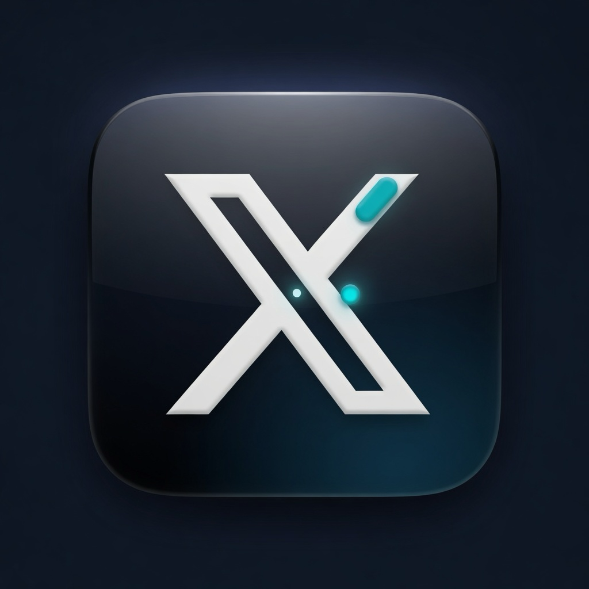
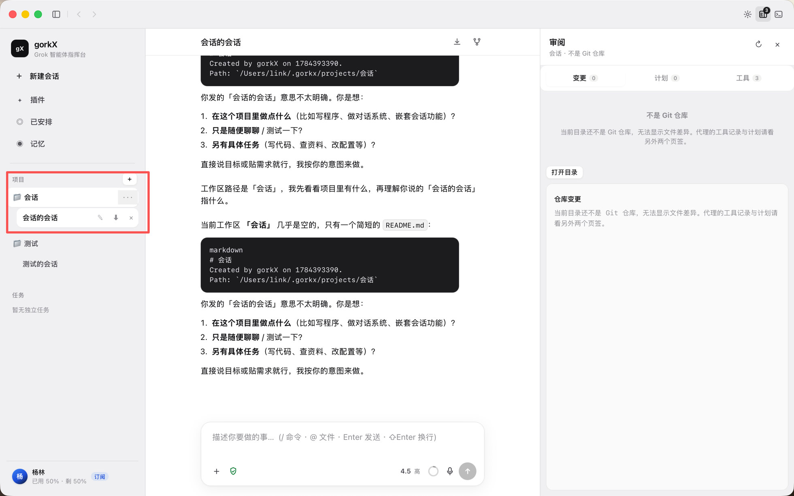
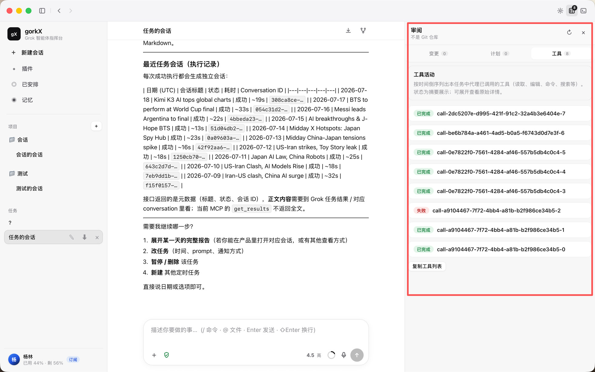
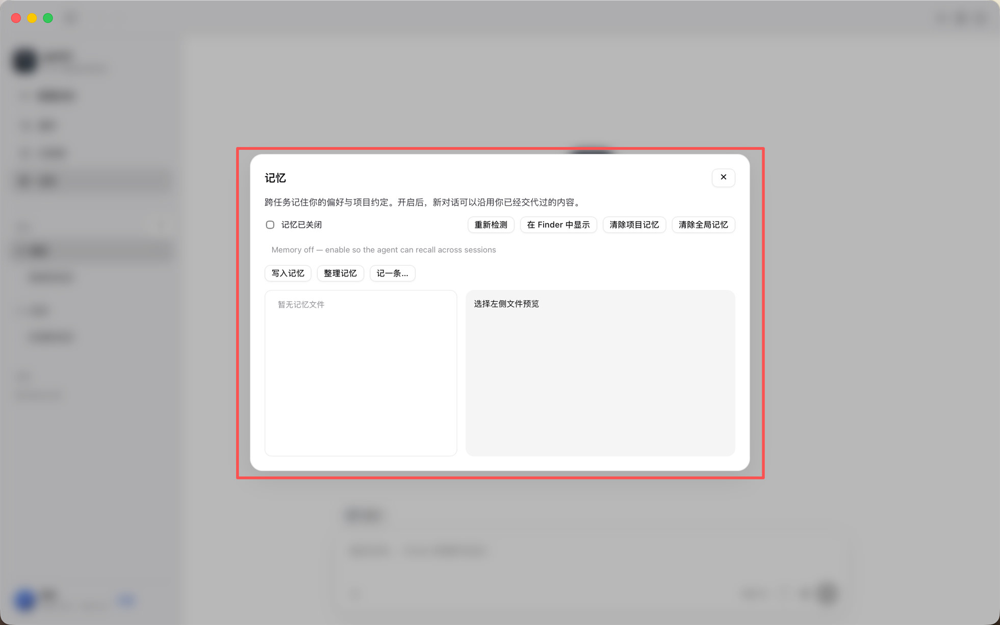

# gorkX

<p align="center">
  
</p>

<p align="center"><strong>Grok Build, without the terminal tax.</strong></p>

<p align="center">
  A calm, visual command center for turning a question, folder, or rough brief
  into work you can direct, inspect, and finish.
</p>

<p align="center">
  <a href="https://github.com/linkyang01/gorkX/releases/download/v1.3.0/gorkX_1.3.0_aarch64.dmg"><strong>↓ Download gorkX 1.3.0</strong></a><br />
  <sub>gorkX 1.3.0 · macOS 12+ · Apple Silicon · <a href="https://github.com/linkyang01/gorkX/releases">all releases</a></sub>
</p>

<p align="center">
  <a href="#why-gorkx">Why gorkX</a> ·
  <a href="#what-you-can-do">What you can do</a> ·
  <a href="#install">Install</a> ·
  <a href="#中文">中文</a>
</p>

<p align="center">
  <a href="https://github.com/linkyang01/gorkX/releases"></a>
  <a href="LICENSE"></a>
  
</p>



## Why gorkX

Grok Build is the engine. gorkX is the place where work happens.

Instead of memorising commands, you describe the outcome: *turn these notes into
a brief*, *compare these options*, *find the regression*, or *make this project
ready to review*. gorkX keeps the response, tools, decisions, files, and next
step in one visible workspace.

It is designed for people who write code and people who simply have work to
finish. The main path is buttons, panels, cards, and guided forms. Slash
commands remain available for experts, but they are never the price of entry.

## What you can do

| You want to… | gorkX gives you… |
|---|---|
| Start from a vague brief | Outcome starters for reports, research, meeting notes, email drafts, decision briefs, project plans, code exploration, fixes, features, and tests. |
| Direct an agent without losing the plot | Streaming replies, visible tool activity, plan review, permission cards, structured questions, goals, follow-ups, and a live run centre. |
| See useful answers clearly | Markdown, tables, compact charts, checklists, step cards, choices, Mermaid flows, and readable diff blocks rendered inside the conversation. |
| Work safely in a real project | Project-scoped sessions, sandbox profiles, allow/deny rules, tool limits, terminal, worktrees, Review, and explicit confirmations for consequential actions. |
| Review before accepting | Git status and diffs, agent-attributed changes, plan and tool history, code navigation, copy/export, and deliverables returned by the agent. |
| Keep context across days | Durable tasks, archive/restore, local memory, project instructions, task search, prompt history, portable task packages, and a seven-day local usage trend. |
| Run more than one thing | Independent tasks, native subagents, a task tree, a cross-task Decisions inbox, scheduled briefings, and recoverable running-task state. |
| Use the tools you already have | Skills, MCP servers, plugins, Chrome/Playwright reading, screenshots, GitHub Device Flow, and guided provider setup. |
| Choose a model honestly | Grok models from the live kernel plus API-compatible providers that pass a real connection test. Unverified models never appear connected; web subscriptions are never disguised as APIs. |
| Speak instead of type | Grok Build's native macOS voice path places a finalized transcript into an editable draft and never sends it automatically. |

### The real kernel inside

The app bundles a source-locked Grok Build engine and talks to it over ACP stdio.
Sessions, login, configuration, and memory live in an app-owned `GROK_HOME`, so
gorkX does not silently borrow a separate CLI installation or browser cookies.
The desktop shell adds clarity and persistence; the agent loop remains Grok
Build's job.

### A result you can hand off

When the engine returns a file or image, the **Deliverables** panel collects that
actual output for preview, Finder reveal, or safe in-project editing. gorkX does
not scan your disk and guess which files are “the result”.





## The gorkX loop

| 1 · Start | 2 · Direct | 3 · Verify | 4 · Continue |
|---|---|---|---|
| Pick a project or begin a task without one. | Use the composer, quick actions, plans, choices, and permission cards. | Inspect the run, files, diff, plan, tools, and deliverables. | Save the context locally, schedule the next step, or hand off a clean result. |

## Built for more than coding

gorkX is equally comfortable with:

- research and comparison;
- reports, briefs, and meeting minutes;
- email and document drafts;
- decision preparation and project planning;
- codebase exploration, debugging, feature work, and tests;
- recurring personal or team routines.

The same conversation can move from a source file to a table, from a plan to a
review, or from a messy note to a shareable deliverable.

## Install

### Requirements

- **macOS 12 or later**
- **Apple Silicon** (M1, M2, M3, M4, and newer)
- A **Grok account** for browser sign-in
- Optional: your own API or OpenAI-compatible provider credentials in Settings

### Install the public build

1. Download **[gorkX 1.3.0 for macOS Apple Silicon](https://github.com/linkyang01/gorkX/releases/download/v1.3.0/gorkX_1.3.0_aarch64.dmg)**.
2. Open the DMG and drag `gorkX` into **Applications**.
3. Open gorkX and complete Grok sign-in in the browser.
4. Choose a project folder, or start a standalone task, then describe the
   outcome you want.

The public build supports Apple Silicon. If macOS blocks the first launch, use
**System Settings → Privacy & Security → Open Anyway**.

### Verify the download (optional)

```bash
shasum -a 256 ~/Downloads/gorkX_1.3.0_aarch64.dmg
# SHA-256: 00d212cfb6e9d498a9eb1fac282215c9feca34da8b65d50ae78f4d6e75040fba
```

### Update and rollback

- Download a newer **gorkX DMG** from [GitHub Releases](https://github.com/linkyang01/gorkX/releases)
  and replace the app in Applications.
- Do not run a generic `grok update` command to update the desktop bundle. The
  bundled kernel is source-controlled and is updated together with gorkX.
- Your local data remains under `~/Library/Application Support/gorkX/`.

### Uninstall

1. Quit gorkX and move `/Applications/gorkX.app` to Trash.
2. Optional: remove local tasks, memory, and app-owned login data:

```bash
rm -rf ~/Library/Application\ Support/gorkX
```

## Privacy and control

gorkX is deliberately explicit about boundaries:

- App state and Grok sessions use an app-owned Application Support directory.
- Project access is scoped to the folder you select; symlink escapes are refused.
- API secrets stay in macOS Keychain or the provider environment, not in task
  transcripts, SQLite, logs, or README examples.
- Tools, writes, Git actions, cloud changes, diagnostics, and sharing use visible
  confirmations where they matter.
- Third-party connectors appear as connected only after their real authorization
  path succeeds.
- Calendar, Slack, Feishu, Notion, and Drive-style integrations are introduced
  only when an official authorization chain is available; no fake “connected”
  state is shown.

For the complete real / kernel-wired / staged capability map, see
[`docs/FEATURES.md`](docs/FEATURES.md). For the 1.3.0 validation evidence and
known acceptance boundaries, see [`docs/VALIDATION_EVIDENCE.md`](docs/VALIDATION_EVIDENCE.md).

## Run from source

```bash
git clone https://github.com/linkyang01/gorkX.git
cd gorkX/apps/desktop
npm install
npm run tauri dev
```

Build a local App Bundle:

```bash
npm run build:app
# apps/desktop/src-tauri/target/release/bundle/macos/gorkX.app
```

Useful checks:

```bash
npx tsc --noEmit
npm run test:stages
npm run build
cd src-tauri && cargo test && cargo check
```

## Contribute

The best contributions make an agent easier to direct, easier to audit, and
more useful to people who have work to finish. Issues and pull requests are
welcome. If gorkX is useful to you, a star helps other builders find it.

## License

[Apache-2.0](LICENSE)

---

# 中文

<p align="center"><strong>把 Grok Build 变成真正好用的桌面工作台。</strong></p>

<p align="center">
  不用先学命令。说清楚你想完成什么，gorkX 帮你把过程、权限、结果和下一步放在一个看得见的工作空间里。
</p>

<p align="center">
  <a href="https://github.com/linkyang01/gorkX/releases/download/v1.3.0/gorkX_1.3.0_aarch64.dmg"><strong>↓ 下载 gorkX 1.3.0</strong></a><br />
  <sub>gorkX 1.3.0 · macOS 12+ · Apple Silicon · <a href="https://github.com/linkyang01/gorkX/releases">查看全部版本</a></sub>
</p>

## 为什么选择 gorkX

Grok Build 是内核，gorkX 是工作的桌面入口。

你可以直接说：**把这些笔记整理成简报、比较几个方案、找出这个缺陷、把项目准备好审阅**。不用记住命令，也不用在终端和多个窗口之间来回切换。gorkX 把回答、工具调用、权限请求、计划、文件和交付物留在同一个可回看的空间里。

它既服务于开发，也服务于研究、写作、运营和日常办公。普通用户走按钮、面板、卡片和引导表单；熟悉命令的人仍然可以使用 slash 快捷方式。

## 你能用它完成什么

| 你想做什么 | gorkX 怎么帮你 |
|---|---|
| 从一句模糊需求开始 | 阅读总结、报告、调研、会议纪要、邮件、决策简报、项目计划，以及探索代码、修缺陷、加功能、补测试等入口。 |
| 始终知道 Agent 在做什么 | 流式回答、工具过程、计划审阅、权限卡、结构化问题、目标、后续建议和运行中心。 |
| 让结果更容易阅读 | Markdown、表格、图表、清单、步骤卡、选项、Mermaid 流程图和 diff 都直接显示在会话里。 |
| 安全处理真实项目 | 项目范围、沙箱、工具限制、allow/deny 规则、终端、工作树、Review 和重要操作确认。 |
| 接受改动前先看清楚 | Git 状态和 diff、代理变更、计划、工具历史、代码导航、复制/导出和成果中心。 |
| 让上下文延续下去 | 持久会话、归档恢复、本地记忆、项目指令、任务搜索、提示历史、任务包和近 7 天本地使用趋势。 |
| 同时推进多个任务 | 独立任务、原生子 Agent、任务树、跨会话待处理事项、计划任务和可恢复的运行状态。 |
| 连接已有工具 | Skills、MCP、插件、Chrome/Playwright、截图、GitHub 官方 Device Flow 和引导式模型配置。 |
| 选择模型但不被假状态误导 | Grok 模型来自实时内核；第三方模型必须真实连接测试通过才显示为可用，网页订阅不会被包装成 API。 |
| 用说话代替输入 | 使用 Grok Build 原生 macOS 语音链路，把最终听写放进可编辑草稿，绝不自动发送。 |

### 内置的是真内核

gorkX 内置源码锁定的 Grok Build，通过 ACP stdio 驱动 Agent。会话、登录、配置和记忆放在应用自管的 `GROK_HOME` 中，不会悄悄读取另一套 CLI 数据或浏览器 Cookie。桌面端负责把能力变得清楚、可操作、可持久化；Agent 循环仍由 Grok Build 负责。

### 结果可以直接交接

Agent 真正返回的文件或图片会进入**成果中心**，可以预览、在 Finder 中打开或安全编辑。gorkX 不会扫描你的硬盘，更不会猜哪个文件是“成果”。


## gorkX 的工作闭环

| 1 · 开始 | 2 · 指挥 | 3 · 验收 | 4 · 延续 |
|---|---|---|---|
| 选择项目，或直接新建任务。 | 使用输入框、快捷操作、计划、选项和权限卡。 | 查看过程、文件、diff、计划、工具和成果。 | 保存上下文、安排下一步，或交接一个干净的结果。 |

## 不只是写代码

gorkX 同样适合：

- 资料调研与方案对比；
- 报告、简报、会议纪要和邮件草稿；
- 决策准备与项目计划；
- 代码库探索、缺陷定位、功能开发和测试；
- 可重复的个人或团队工作流程。

同一段会话可以从源文件走到表格，从计划走到审阅，也可以把一堆零散材料变成可交付文稿。

## 安装

### 系统要求

- **macOS 12 或更高版本**
- **Apple Silicon**（M1/M2/M3/M4 及更新芯片）
- 用于浏览器登录的 **Grok 账号**
- 可选：在设置中配置自己的 API 或 OpenAI-compatible 模型

### 安装公开版本

1. 下载 **[gorkX 1.3.0（macOS Apple Silicon）](https://github.com/linkyang01/gorkX/releases/download/v1.3.0/gorkX_1.3.0_aarch64.dmg)**。
2. 打开 DMG，把 `gorkX` 拖入“应用程序”。
3. 打开 gorkX，在浏览器完成 Grok 登录。
4. 选择项目文件夹，或直接开始一个独立任务，然后描述你要完成的结果。

公开版本支持 Apple Silicon。如果 macOS 阻止首次打开，请到“系统设置 → 隐私与安全性”点击“仍要打开”。

### 可选：校验下载文件

```bash
shasum -a 256 ~/Downloads/gorkX_1.3.0_aarch64.dmg
# SHA-256：00d212cfb6e9d498a9eb1fac282215c9feca34da8b65d50ae78f4d6e75040fba
```

### 更新与回退

- 从 [GitHub Releases](https://github.com/linkyang01/gorkX/releases) 下载新的 gorkX DMG，覆盖“应用程序”中的旧版本。
- 不要用通用 `grok update` 命令升级桌面内核；内核源码由 gorkX 锁定并随应用一起更新。
- 本地数据默认保存在 `~/Library/Application Support/gorkX/`。

### 卸载

1. 退出 gorkX，把 `/Applications/gorkX.app` 移到废纸篓。
2. 如需同时删除任务、记忆和应用登录数据，可执行：

```bash
rm -rf ~/Library/Application\ Support/gorkX
```

## 隐私与控制

- 应用状态和 Grok 会话使用独立的 Application Support 目录。
- 项目访问限制在你选择的文件夹内，并拒绝通过符号链接越界。
- API 密钥只进入 macOS Keychain 或提供商环境变量，不写入会话、SQLite、日志或示例文档。
- 工具、写入、Git、云端操作、诊断和分享等重要动作会显示确认。
- 第三方平台只有真实授权成功后才会显示为已连接。
- 日历、Slack、飞书、Notion、Drive 等连接器会在官方授权链完整后逐步开放，不会显示假的“已连接”。

完整的 Real / Kernel-wired / 分阶段能力表见
[`docs/FEATURES.md`](docs/FEATURES.md)；1.3.0 的验收证据与已知边界见
[`docs/VALIDATION_EVIDENCE.md`](docs/VALIDATION_EVIDENCE.md)。

## 从源码运行

```bash
git clone https://github.com/linkyang01/gorkX.git
cd gorkX/apps/desktop
npm install
npm run tauri dev
```

构建本地 App：

```bash
npm run build:app
# apps/desktop/src-tauri/target/release/bundle/macos/gorkX.app
```

常用检查：

```bash
npx tsc --noEmit
npm run test:stages
npm run build
cd src-tauri && cargo test && cargo check
```

## 参与贡献

欢迎提交 Issue 和 Pull Request。最有价值的改进，是让 Agent 更容易指挥、更容易审阅，也更能帮助普通人把事情做完。如果 gorkX 对你有帮助，欢迎给仓库点个 Star。

## 许可证

[Apache-2.0](LICENSE)
